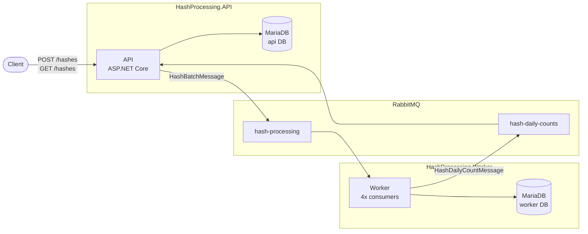
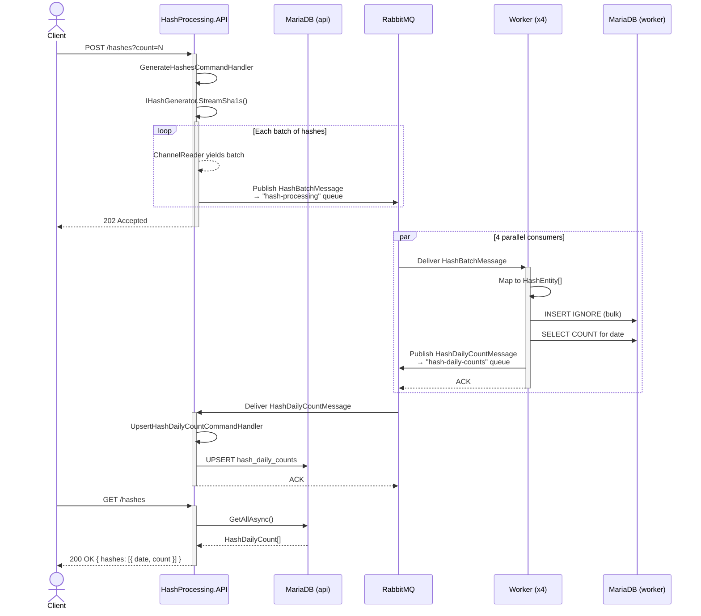

# HashProcessing

A distributed SHA-1 hash generation and processing pipeline built with .NET 8, RabbitMQ, and Docker. The API generates hashes, batches them, and publishes to a message queue for parallel consumption by a worker service, which persists them and publishes daily count aggregations back to the API.

[Overview](#overview) · [Architecture](#architecture) · [Design decisions](#design-decisions) · [Getting started](#getting-started) · [API](#api) · [Project structure](#project-structure)

## Overview

HashProcessing is a two-service system designed for high-throughput hash generation and processing:

- **API** — ASP.NET Core Minimal API that generates SHA-1 hashes using `System.Security.Cryptography`, streams them through a bounded `Channel<T>`, batches them, and publishes to RabbitMQ. Also consumes daily count aggregation events from the worker and exposes them via `GET /hashes`.
- **Worker** — Background service that consumes hash batches from RabbitMQ using 4 parallel consumers, maps messages through an anti-corruption layer, persists hashes to MariaDB via EF Core, and publishes daily count aggregations back to the API via a dedicated queue.

### Features

- Streaming hash generation via `System.Threading.Channels` for backpressure-aware, non-blocking pipelines
- Configurable parallel hash generation (`Parallel.ForAsync`) and parallel batch publishing
- Batched RabbitMQ publishing with persistent delivery mode and Polly resilience (retry with exponential backoff + circuit breaker) for transient broker/network failures
- 4-thread parallel RabbitMQ consumption with manual acknowledgement
- Anti-corruption layer: contract messages (`HashBatchMessage`) mapped to domain entities (`HashEntity`) before persistence
- Event-driven daily count aggregation: Worker publishes `HashDailyCountMessage` → API consumes and upserts counts
- Shared `HashProcessing.Messaging` library with generic `RabbitMqPublisher` and `RabbitMqConsumer<T>` base types
- MariaDB persistence via EF Core (Pomelo) with auto-migration on startup (separate databases for API and Worker)
- Clean Architecture with minimal DDD tactical patterns (value objects, domain service ports, CQRS command handlers)
- Multi-stage Docker builds for both services
- HTTPS-enabled local development with scripted certificate bootstrap
- OpenAPI/Swagger UI in development mode
- Rate limiting on `POST /hashes` (fixed window, 5 requests/minute) with `429 Too Many Requests` response
- Input cap: maximum 1,000,000 hashes per request
- Global error handling with RFC 7807 ProblemDetails responses
- Health check endpoint (`GET /health`) on both API and Worker with MariaDB connectivity probe
- HSTS enforcement in production
- Least-privilege database users per service (`api_user`, `worker_user`)
- Dedicated RabbitMQ user (`hashprocessing`) with scoped permissions
- EF Core transient fault retry strategy (`EnableRetryOnFailure`)
- Docker Compose healthcheck probes for all services

## Architecture

### System components



### Layer dependency

The solution follows **Clean Architecture** with inward-only dependency flow:

```
Core (Domain)  ←  Application  ←  Infrastructure
```

| Layer | Responsibility | Key types |
|---|---|---|
| **Core** | Value objects, domain service ports | `Sha1Hash`, `IGeneratedHash`, `IHashGenerator`, `IHashProcessor`, `IHashDailyCountRepository`, `HashDailyCount` |
| **Application** | Use-case handlers (CQRS) | `GenerateHashesCommand`, `UpsertHashDailyCountCommand` + handlers |
| **Infrastructure** | Concrete implementations, consumers | `DefaultHashGenerator`, `ParallelHashGenerator`, `RabbitMqBatchedOffloadToWorkerProcessor`, `HashDailyCountRepository`, `HashDailyCountEventConsumer`, `ApiDbContext` |

**Worker layers:**

| Layer | Responsibility | Key types |
|---|---|---|
| **Core** | Domain entity, repository port | `HashEntity`, `IHashRepository` |
| **Application** | Use-case handler (CQRS) | `ProcessReceivedHashesCommand`, `ProcessReceivedHashesCommandHandler` |
| **Infrastructure** | EF Core persistence, RabbitMQ consumer, publisher | `HashDbContext`, `HashRepository`, `RabbitMqHashConsumer`, `RabbitMqPublisher` |

**Processing pipeline:**

```
POST /hashes → GenerateHashesCommandHandler
  → IHashGenerator.StreamSha1s()        // ChannelReader<Sha1Hash>
  → IHashProcessor.ProcessAsync()       // batch + parallel publish
  → RabbitMQ queue "hash-processing"
  → 202 Accepted

Worker (4 parallel consumers)
  → RabbitMQ queue "hash-processing"
  → HashBatchMessage (contract)          // anti-corruption layer
  → HashEntity (domain)                  // mapper
  → MariaDB hashes table                 // EF Core bulk insert
  → RabbitMQ queue "hash-daily-counts"   // publish aggregated count

API (background consumer)
  → RabbitMQ queue "hash-daily-counts"
  → HashDailyCountMessage (contract)     // anti-corruption layer
  → UpsertHashDailyCountCommandHandler   // upsert to hash_daily_counts table

GET /hashes → GetHashesQueryHandler
  → IHashDailyCountRepository.GetAllAsync()
  → 200 OK { hashes: [{ date, count }] }
```

### Sequence diagram



RabbitMQ topology is defined declaratively in [rabbitmq/definitions.json](rabbitmq/definitions.json) and loaded automatically on container startup via [rabbitmq/rabbitmq.conf](rabbitmq/rabbitmq.conf). Two durable queues are provisioned: `hash-processing` (API → Worker) and `hash-daily-counts` (Worker → API).

## Getting started

### Prerequisites

- [.NET SDK 8.x](https://dotnet.microsoft.com/download/dotnet/8.0)
- [Docker Desktop](https://www.docker.com/products/docker-desktop/) (or compatible Docker Engine with Compose)
- [PowerShell 7.4+](https://learn.microsoft.com/en-us/powershell/scripting/install/installing-powershell)

### Run with Docker (recommended)

1. Generate and trust a local HTTPS development certificate:

   ```powershell
   ./scripts/setup-dev-https.ps1
   ```

   The script generates an ASP.NET Core dev certificate, exports it as a PFX for Docker, and trusts it on your machine. Works on Windows, macOS, and Linux.

2. Start both services:

   ```bash
   docker compose up --build
   ```

3. Open the API:

   | Endpoint | URL |
   |---|---|
   | HTTP | `http://localhost:8080` |
   | HTTPS | `https://localhost:8081` |
   | Swagger UI | `https://localhost:8081/swagger` |

> [!NOTE]
> Override the certificate password by setting `HTTPS_CERT_PASSWORD` before running the setup script.
> If your browser still shows a certificate warning after running the script, try a private/incognito window or clear the browser's cached certificates.

### Run without Docker

```bash
dotnet run --project src/HashProcessing.Api
```

The API will be available at `http://localhost:5031` (and `https://localhost:7093`).

> [!IMPORTANT]
> A running RabbitMQ instance and MariaDB instance on `localhost` are required for hash processing to work outside Docker.

> [!NOTE]
> The first `docker compose up` run executes `mariadb/init.sql` to create databases and least-privilege users. If you need to re-initialize the database (e.g., after changing credentials), run `docker compose down -v` first to remove the MariaDB volume.

## API

| Method | Route | Description |
|---|---|---|
| `POST` | `/hashes?count={n}` | Generate SHA-1 hashes (default 40,000, max 1,000,000), batch and publish to RabbitMQ. Returns `202 Accepted`. Rate-limited to 5 req/min. |
| `GET` | `/hashes` | Return aggregated daily hash counts ordered by date descending. |
| `GET` | `/health` | Health check endpoint. Returns `200 OK` when the API and its MariaDB connection are healthy. |

### Examples

```bash
# Generate hashes (default 40,000)
curl -X POST https://localhost:8081/hashes

# Generate a custom number of hashes
curl -X POST 'https://localhost:8081/hashes?count=10000'

# Retrieve daily hash counts
curl https://localhost:8081/hashes
```

## Running tests

```bash
dotnet test
```

## Benchmarks

Performance benchmarks use [BenchmarkDotNet](https://benchmarkdotnet.org/) with Testcontainers for real RabbitMQ infrastructure. Docker must be running for pipeline benchmarks.

### Available benchmarks

| Benchmark | What it measures | Docker required |
|---|---|---|
| `HashGeneratorIsolatedBenchmark` | Raw hash generation throughput: `DefaultHashGenerator` vs `ParallelHashGenerator` across 100–100K hashes | No |
| `HashGenerationPipelineBenchmark` | End-to-end generate → batch → publish through real `RabbitMqBatchedOffloadToWorkerProcessor` against a Testcontainers RabbitMQ instance (1K–100K hashes) | Yes |
| `ParallelDegreeOfParallelismBenchmark` | Optimal `ParallelHashGenerator` degree of parallelism (1, 2, 4, 8, ProcessorCount) at 40K hashes with real RabbitMQ | Yes |
| `BatchSizeBenchmark` | Optimal RabbitMQ publish batch size (10–40K) at 1M hashes with real RabbitMQ | Yes |
| `HighBatchSizeBenchmark` | Full end-to-end roundtrip: HTTP POST 200K hashes with varying batch sizes (500–10K), measuring total pipeline time with real RabbitMQ + MariaDB + Worker | Yes |

### Running benchmarks

```bash
# Run all benchmarks
dotnet run -c Release --project tests/HashProcessing.Benchmarks

# Run only the isolated (no Docker) benchmark
dotnet run -c Release --project tests/HashProcessing.Benchmarks -- --filter *Isolated*

# Run only the pipeline benchmark
dotnet run -c Release --project tests/HashProcessing.Benchmarks -- --filter *Pipeline*

# Run only the batch size benchmark
dotnet run -c Release --project tests/HashProcessing.Benchmarks -- --filter *BatchSize*

# Run only the end-to-end high batch size benchmark
dotnet run -c Release --project tests/HashProcessing.Benchmarks -- --filter *HighBatchSize*

# Quick validation (dry run, no actual measurement)
dotnet run -c Release --project tests/HashProcessing.Benchmarks -- --job dry
```

Results are written to `tests/HashProcessing.Benchmarks/BenchmarkDotNet.Artifacts/`.

## Project structure

```text
HashProcessing/
├── compose.yaml                         # Docker Compose (API + Worker + RabbitMQ + MariaDB)
├── global.json                          # .NET SDK version pinning
├── mariadb/
│   └── init.sql                         # Creates databases + least-privilege users (api_user, worker_user)
├── rabbitmq/
│   ├── definitions.json                 # RabbitMQ topology (queues, exchanges, bindings)
│   └── rabbitmq.conf                    # RabbitMQ config — loads definitions on startup
├── scripts/
│   └── setup-dev-https.ps1              # HTTPS certificate bootstrap (PowerShell 7+, cross-platform)
├── src/
│   ├── HashProcessing.Api/
│   │   ├── Program.cs                   # Host builder, endpoints, middleware
│   │   ├── Dockerfile                   # Multi-stage build → Alpine ASP.NET 8.0
│   │   ├── Application/                 # CQRS commands/queries + handlers, DI
│   │   ├── Core/                        # Domain: Sha1Hash, HashDailyCount, interfaces
│   │   └── Infrastructure/              # RabbitMQ processor, hash generators, EF Core, consumer
│   ├── HashProcessing.Messaging/        # Shared: RabbitMqPublisher, RabbitMqConsumer<T>, message contracts
│   └── HashProcessing.Worker/
│       ├── Program.cs                   # Host builder, health check endpoint, auto-migration
│       ├── Worker.cs                    # BackgroundService — 4 parallel consumers
│       ├── Dockerfile                   # Multi-stage build → Alpine ASP.NET 8.0
│       ├── Application/                 # CQRS command + handler (ProcessReceivedHashes)
│       ├── Core/                        # Domain: HashEntity, IHashRepository
│       └── Infrastructure/              # EF Core DbContext, RabbitMQ consumer, publisher
└── tests/
    ├── HashProcessing.Api.UnitTests/    # xUnit + NSubstitute
    ├── HashProcessing.Benchmarks/       # BenchmarkDotNet + Testcontainers
    └── HashProcessing.IntegrationTests/ # xUnit + Testcontainers
```

## Design decisions

### Raw SQL over EF Core ORM for bulk operations

The Worker's `HashRepository` uses `INSERT IGNORE` instead of EF Core's `AddRange`/`SaveChangesAsync`. With batches of up to 10,000 hashes, a single `INSERT IGNORE` statement eliminates per-row change-tracker overhead entirely. The API's `HashDailyCountRepository` uses `INSERT ... ON DUPLICATE KEY UPDATE count = GREATEST(count, ?)` for atomic upserts — `GREATEST` prevents count rollback when concurrent workers publish overlapping aggregations for the same date.

### Event-driven daily count aggregation

The challenge requires daily hash counts "without recalculating on the fly." Rather than running `COUNT(*)` on a table that can grow to millions of rows, the system uses event-driven aggregation: after each batch insert, the Worker queries the count per date and publishes a `HashDailyCountMessage` to a dedicated `hash-daily-counts` queue. The API consumes these events and upserts into a small `hash_daily_counts` table, making `GET /hashes` a trivial read.

### Separate databases per service

The API and Worker each use their own MariaDB logical database (`api` and `worker`). This avoids shared-database coupling, prevents schema collisions, and allows independent scaling or migration.

### RabbitMQ channel pool

A semaphore-gated `PublisherChannelPool` (sized to `Environment.ProcessorCount × 2`) manages channel lifecycle. Channels are returned to a `ConcurrentQueue` on disposal and health-checked on acquire. Publisher confirmations and tracking are enabled, ensuring the broker acknowledges every published message.

### Messaging resilience

Multiple layers protect against message loss:

- **Polly retry pipeline** — 3 attempts with exponential backoff (200 ms base) for transient broker/network exceptions (`AlreadyClosedException`, `BrokerUnreachableException`, `IOException`, `SocketException`)
- **Polly circuit breaker** — breaks the `RabbitMqPublisher` circuit after a 50% failure rate (minimum 5 calls in a 30 s window) and holds open for 15 s before half-opening. Prevents cascading failures when RabbitMQ is degraded.
- **EF Core transient retry** — `EnableRetryOnFailure` (3 attempts, 5 s max delay) on both API and Worker database contexts handles transient MariaDB connectivity issues without manual Polly wrappers
- **Persistent delivery mode** — all published messages are marked `Persistent = true`, surviving broker restarts
- **Dead-letter queues** — both `hash-processing` and `hash-daily-counts` queues route nacked messages to per-queue DLQs via a `dlx` direct exchange, declared in `rabbitmq/definitions.json`
- **Manual acknowledgement** — `autoAck: false` with explicit `BasicAckAsync` on success and `BasicNackAsync` (requeue: false) on failure, routing poison messages to the DLQ

### ParallelHashGenerator as a benchmark-only alternative

`ParallelHashGenerator` uses `Parallel.ForAsync` for multi-threaded SHA-1 generation but is **not registered in DI** — only `DefaultHashGenerator` runs in production. Benchmarks consistently show the parallel variant is 10–17% slower due to thread coordination overhead outweighing the lightweight SHA-1 computation. It remains in the codebase as a documented experiment and benchmark comparison point.

## Tech stack

| Component | Technology |
|---|---|
| Framework | .NET 8 / ASP.NET Core Minimal API |
| Database | MariaDB 11 (via Pomelo.EntityFrameworkCore.MySql 8.x) |
| Messaging | RabbitMQ (`RabbitMQ.Client` 7.x) |
| Concurrency | `System.Threading.Channels`, `Parallel.ForAsync` |
| Resilience | Polly (retry + circuit breaker) |
| API docs | OpenAPI / Swashbuckle |
| Containers | Docker multi-stage Alpine builds, Docker Compose |
| Testing | xUnit, NSubstitute, coverlet |
| Benchmarking | BenchmarkDotNet, Testcontainers |
